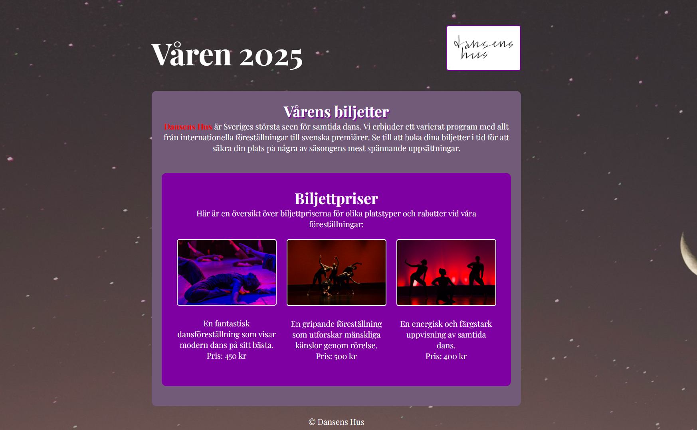

# Prov 1d

## Inspelning av hela provet krävs för godkänt betyg
1. Starta inspelningen i **Chronicler**
1. Arbeta med uppgiften
1. När du är klar **commit & sync**
1. Stoppa inspelningen i **Chronicler** och lämna in videon på **Classroom**

## Provet



### Uppgift
- Skapa en sida som ser ut som skärmdumpen ovan.
- Sidan skall vara **800px bred och centrerad**.
- Använd typsnittet **"Playfair Display"** från Google Fonts: 
```css
@import url('https://fonts.googleapis.com/css2?family=Playfair+Display:ital,wght@0,400..900;1,400..900&display=swap');
font-family: "Playfair Display", serif;
```
- Länka **"Dansens Hus"** till den riktiga webbplatsen: https://dansenshus.se

### Kvalité
* Kommentera din kod.
* Indentera din kod så den är tydlig att följa.

### Dokumentation
Du får titta på följande sidor:
* [HTML](https://www.w3schools.com/html)
* [CSS](https://www.w3schools.com/css/default.asp)
* [Javascript](https://www.w3schools.com/js/default.asp)

### CSS-reset

Använd följande CSS-reset för att nollställa alla standardvärden i webbläsaren:
```css
/* Enkel CSS-reset */
html {
    box-sizing: border-box;
}
*, *:before, *:after {
    box-sizing: inherit;
}
body, h1, h2, h3, h4, h5, h6, p, ul {
    margin: 0;
    padding: 0;
}
img {
    max-width: 100%;
    height: auto;
}
```

## Material som används

### Text som används
> "Dansens Hus är Sveriges största scen för samtida dans. Vi erbjuder ett varierat program med allt från internationella föreställningar till svenska premiärer. Se till att boka dina biljetter i tid för att säkra din plats på några av säsongens mest spännande uppsättningar."

> "Här är en översikt över biljettpriserna för olika platstyper och rabatter vid våra föreställningar:"

### Färger som används

* <code style="background:#725b79; color:#fff">#725b79</code>
* <code style="background:#7e00a2; color:#fff">#7e00a2</code>
* <code style="background:red; color:#000">red</code>
